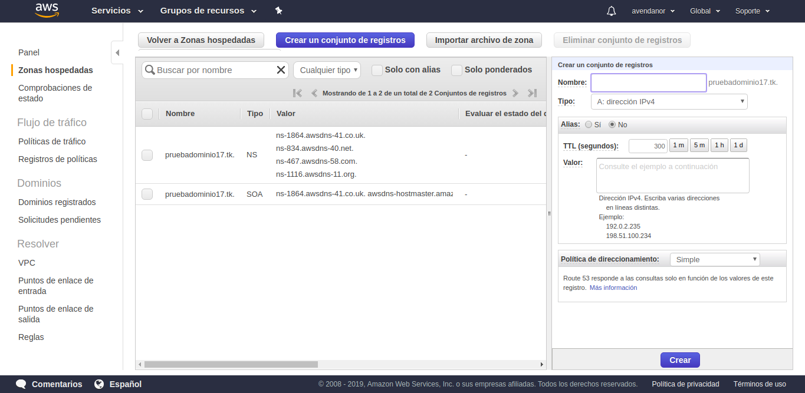

# TET-Project4
Materia: Topicos Especiales en Telemática

- Douglas Ardila Garcés dardila5@eafit.edu.co
- Andrés Felipe Avendaño aavenda1@eafit.edu.co 
- Felipe Macías Herrera fmacias1@eafit.edu.co 

## Descripción

Aplicación Web Escalable en la nube de AWS con atributos de calidad como: Disponibilidad, Rendimiento y Seguridad.

## Mongo Atlas

- Crear una cuenta en [MongoDB Atlas](https://www.mongodb.com/)

- Crear un nuevo cluster MongoDB Atlas con una nueva base de datos
- Para conectar AWS con el cluster MongoDB Atlas seguir el siguiente tutorial https://youtu.be/BfLZUGjwyAs 
- Conectar la App Web con el cluster creado

## Obtener dominio

- Crear una cuenta en [Freenom](https://my.freenom.com/)

- Ir a services --> Register a New Domain

- Ingresar un nombre de dominio y verificar que esté disponible
- Seleccionar una extensión disponible

- Ingresar el DNS del balanceador de carga 

## Route 53
- En la consola de AWS ir a Route 53
- Crear una zona hospedada
- Ingresar el nombre del dominio

- Crear un conjunto de registros

- Seleccionar "Si" en Alias

- Elegir el DNS del balanceador de carga
- Copiar los 4 nameservers

- Poner los nameservers en los ajustes del dominio creado en freenom

## Balanceador de carga

