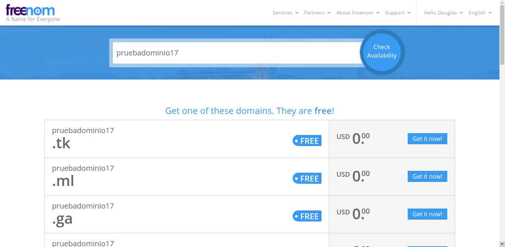

# TET-Project4
Materia: Topicos Especiales en Telemática

- Douglas Ardila Garcés dardila5@eafit.edu.co
- Andrés Felipe Avendaño aavenda1@eafit.edu.co 
- Felipe Macías Herrera fmacias1@eafit.edu.co 

## Descripción

Aplicación Web Escalable en la nube de AWS con atributos de calidad como: Disponibilidad, Rendimiento y Seguridad.

## Mongo Atlas

- Crear una cuenta en [MongoDB Atlas](https://www.mongodb.com/)

- Crear un nuevo cluster MongoDB Atlas con una nueva base de datos
- Para conectar AWS con el cluster MongoDB Atlas seguir el siguiente tutorial https://youtu.be/BfLZUGjwyAs 
- Conectar la App Web con el cluster creado

## Balanceador de carga

El balanceador de carga es un sistema que permite direccionar el tráfico de peticiones entre distintios servidores de manera equitativa.
Para este proyecto se implementó el sistema de balanceador de carga proporcionado por AWS, el cual a continuación se mostrará el proceso de configuración.

En primer lugar se elegirá la opción de Load Balancer en el Dashboard de EC2, y se da clic en Create Load Balancer:

Una vez realizado lo anterior, se procederá a una página en donde se seleccionará el tipo de balanceador de carga a implementar, en el caso concreto se elegirá Classic Load Balancer.

Después, se procede a configurar el LB, para esto primero se le da un nombre y se le asigna la VPC en la cual trabajará. En este punto es importante definir que la VPC es la misma en la cual está ubicada MongoAtlas.
Luego, es importante abrir los puertos HTTP y HTTPS para que el LB pueda comunicarse y desingar las subredes en las cuales estarán las instancias de la aplicación. 

Una vez hecho lo anterior, se procede a asignar el Security Group, en este caso debe de ser el mismo creado para MongoAtlas.

El siguiente paso corresponde a configurar la seguridad, y para esto es necesario ligar los certificados necesarios, en este proyecto esto fueron generados con AWS Certificate Manager.

Al completar los pasos anteriores de manera exitosa, la configuración del LB será la siguiente:

Si es así, se da clic en Create y se espera que todo salga de manera exitosa.

## Launch Configuration

Una vez creado el LB, se procese a configurar el Launch Configuration.
El Launch Configuration permite definifir cómo se llevará a cabo el escalamiento y despliegue de la aplicación.
Primero, se ubica  Launch Configurations en el Dashboard y se da clic en Create.

El primer paso es definir el tipo de instancia EC2 en la cual se desplegará la aplicación. En este caso se elige una imagen de EC2 creada anteriormente, esta imagen ya tiene instala docker, docker-compose y github. El hecho de que sea imagen significa que todas que todas las instancias creadas a partir de esta tendrán la misma configuración.

Después, se procede a asignar un nombre a esta configuración.
Un paso muy importante es definir un script que se ejecutará cada vez que una nueva instancia sea lanzada. El script utilizado básicamente hace clone del repositorio de la aplicación y ejecuta docker-compose build y up, además de la configuración de los certificados SSL para HTTPS.

    #! /bin/bash
    sudo yum update -y
    sudo amazon-linux-extras install docker
    sudo service docker start
    sudo usermod -a -G docker ec2-user
    sudo curl -L https://github.com/docker/compose/releases/download/1.22.0/docker-compose-$(uname -s)-$(uname -m) -o /usr/local/bin/docker-compose
    sudo chmod +x /usr/local/bin/docker-compose
    sudo yum update
    sudo yum install git
    git clone https://github.com/pipe980819/TET-project4.git
    cd TET-project4
    chmod +x init-letsencrypt.sh
    sudo ./init-letsencrypt.sh
 
El script se pone en User Data y como formato texto (as text).

Luego se le asigna un Security Group, nuevamente es importante que este coincida con el de MongoAtlas.

## Auto Scaling Group

Una vez completado el paso anterior, se procede a crear un Auto Scaling Group, este se encarga de definir las políticas de escalado de la aplicación.
Primero, se ubica AutoScaling Group en el Dashboard y se da clic en Create.

Luego, se define que el Lauch Configuration a implementar será el creado anteriormente.

Después, se le asigna un nombre, se le definen el número de instancias EC2 con las cuales se quiere que inicie la aplicación.
Se elige la VPC y las subredes. Es importante recordar que estos últimos dos deben de coincidir con el de MongoAtlas.

El siguiente paso se refiere a crear las políticas de escalamiento (alarmas) de la aplicación.
En este caso se definieron dos, una de crecimiento y otra de decremento.
En la primera, se define que se creará una instancia más cuando el porcentaje de utilización de una CPU esté por encima del 80% durante un periodo de más de 5 minutos.

En la segunda, se define que se destruirá una instancia cuando el porcentaje de utilización de una CPU esté por debajo del 20% durante un periodo de más de 15 minutos.

Al final, la configuración debería de lucir como a continuación:

Se da clic en Create.

Después, luego de finalizada la creación, nos dirigimos a editar el Auto Scaling Group acabado de crear, y se le asigna el Load Balancer previamente creado y se guarda.

## Obtener dominio

- Crear una cuenta en [Freenom](https://my.freenom.com/)

- Ir a services --> Register a New Domain

- Ingresar un nombre de dominio y verificar que esté disponible
- Seleccionar una extensión disponible

- Ingresar el DNS del balanceador de carga 

## Route 53
- En la consola de AWS ir a Route 53
- Crear una zona hospedada
- Ingresar el nombre del dominio

- Crear un conjunto de registros

- Seleccionar "Si" en Alias

- Elegir el DNS del balanceador de carga
- Copiar los 4 nameservers

- Poner los nameservers en los ajustes del dominio creado en freenom

